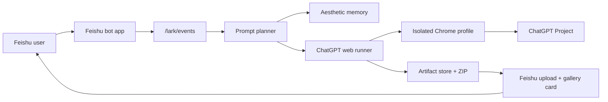

# Architecture



## Runtime Path

1. Feishu sends a text event to `/lark/events`.
2. The service de-duplicates the message ID.
3. The planner creates prompt groups.
4. The browser runner opens one ChatGPT Project tab per group.
5. The runner waits for newly generated images and downloads them.
6. The artifact store writes images and a ZIP archive.
7. The Feishu client uploads images and sends one gallery card.

## Prompt Groups

The planner output keeps these separate:

- `prompt_groups.length`: how many project tabs/chats to open
- `prompt_groups[].image_count`: how many images to ask for in that one chat

Four groups with four images each means sixteen images.

## Storage

```text
data/
  tasks/
    task_xxx/
      img_001.png
      img_002.png
      task_xxx.zip
      task.json
  memory/
    <chat_id>.json
```

## Concurrency

The browser runner holds one lock per Chrome profile. This prevents separate Feishu jobs from operating the same logged-in profile simultaneously. Inside one job, multiple prompt groups can still run as multiple tabs.

